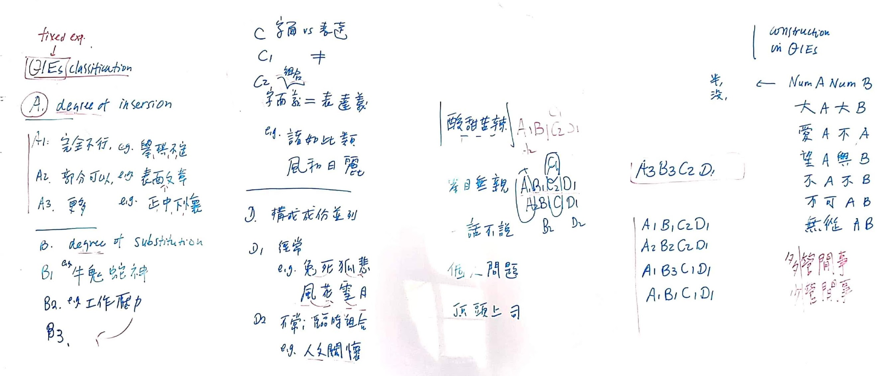
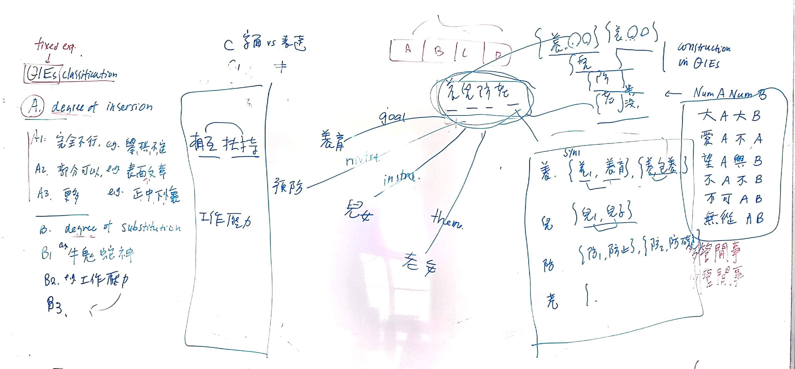



# MwWn-20190418

## 固定語研究

固定語（包含中文四字格）可以分成四個向度（王吉輝，2009）：

* A. 可插入其他詞彙的程度  
  * A1. 完全不行，如舉棋不定  
  * A2. 部分可以，如表面文章（表面之文章）  
  * A3. 可以，如正中下懷（正中他的下懷）

* B. 可替換的程度
  * B1. 不可替換，如牛鬼蛇神
  * B2. 可部分替換
  * B3. 可多部分替換，如工作壓力（變成「課業壓力」）

* C. 字面義 vs. 表達義
  * C1. 字面義 ≠ 表達義，如「酸甜苦辣」，被用來表達味覺以外的的其他意義。
  * C2. 字面義 = 表達義，如「諸如此類」。

* D. 構成成分並列
  * D1. 經常並列，如兔死狐悲、風花雪月
  * D2. 臨時組合，如人文關懷。

## 分析範圍

在這研究中，我們的分析對象是 **「成語以外」的四字格** 。因為成語本身已經有[教育部成語典][moe_idioms]作為規範性的來源，且成語按照定義已經是C1和D1類型，它不需要靠其他方法來描述。在此研究中真正需要尋找的是其他非成語的四字格。尤其是那些因為長久的使用習慣而被單位整體化（unitized）成C1、D1的四字格。

[moe_idioms]: https://resources.publicense.moe.edu.tw/dict_idiomsdict_download.html

## 並列模型：字向量（向度D）

從構詞網路建構的字向量可用來計算向度D的成分並列是否是臨時組合的，或是否符合一般雙字詞構詞就能出現的型態。這部分已經有初步結果可供計算（c.f. [字向量組合模型](MwWn-20190417.md#nodevec)）。成語雖然不是我們的分析範圍，但如果「字向量模型」是有效的，那使用該模型分析非成語四字格和成語四字格，應該要能看到成語四字格的組合機率較低。

> Open Question
> 目前並列模型僅考慮線性相依，但四字格通常是有結構的，如大A大B、愛A不A等。有沒有可能把結構放入模型裡？

## 組合模型：脈絡向量（向度C）

字面義與表達義的區分將用脈絡向量（contextualized embeddings）加以形式化。大致上，我將以四字格中的每個字的脈絡向量組合出一個「字面向量」（literal vector）當作字面義，並以四字格出現的語境的脈絡向量當作「組合向量」（composite vector），這兩個向量的距離就是字面義與組合義之間的差距。

## 四字格與CWN sense連結

我們最終目的是要把非成語的C1D1四字格加入WordNet，並且需要找出可能與之相關Cwn Sense。這步會用到先前Sense vector的想法，用sense vectors先bootstrap出可能與之相關的synset，再由人工確認及標記其關係。

## TODOs
1. 用「字向量模型」比較成語和非成語四字格。
2. 計算四字格的脈絡向量
3. 用「脈絡向量」比較成語和非成語四字格
4. 藉由脈絡向量的四字格，找出可能與之相關的CWN senses
5. 抽樣一部份的四字格，以及可能與之相關的CWN senses，做人工標記。

## 參考文獻

王吉輝（2009）。《固定語研究》。天津：南開大學出版社。