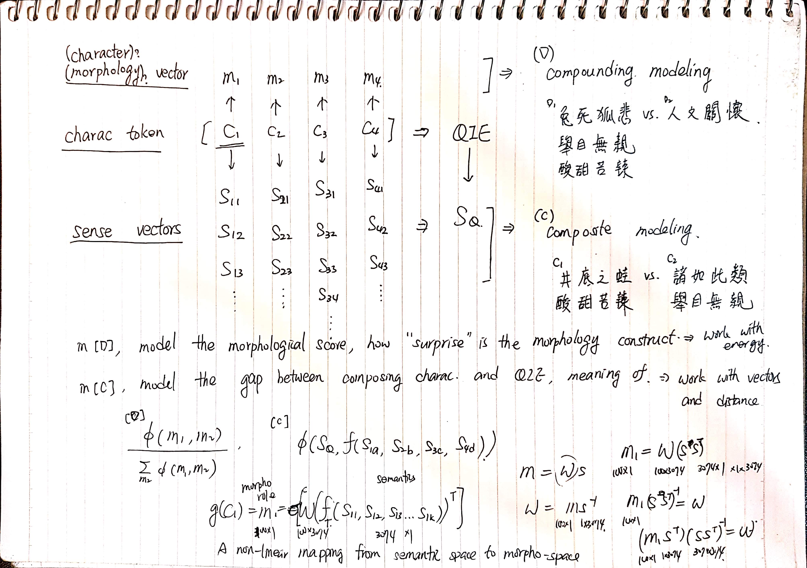



# MwWn-20190419

## Idiomicity Model
1. Bootstrapped from node embedding from morphological graph
3. Obtain sense vectors (S-vector) of respective character
2. find a non-linear mapping from sense space to morphological space
4. transform the sense vector to morphological space
5. calculate compounding index from morphological vector (M-vector)

